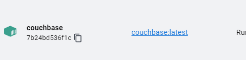
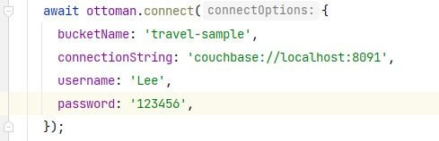
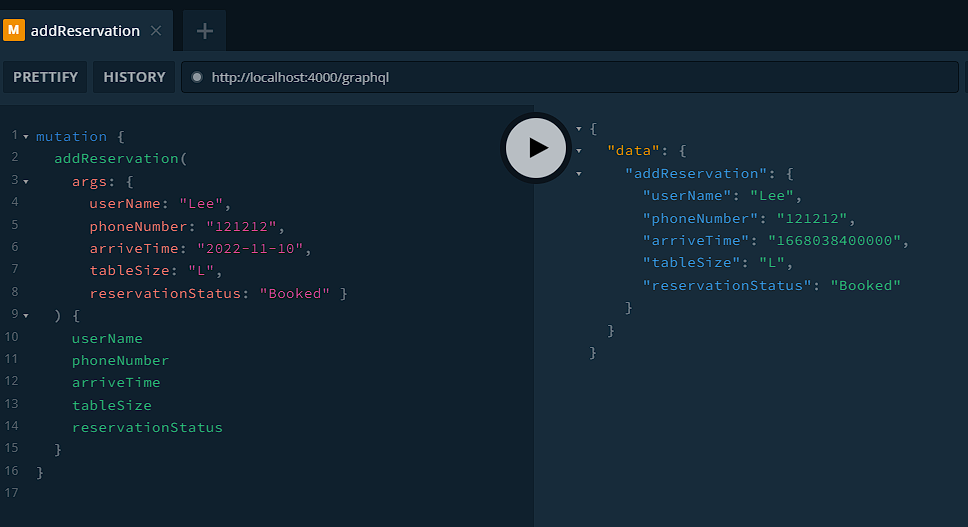
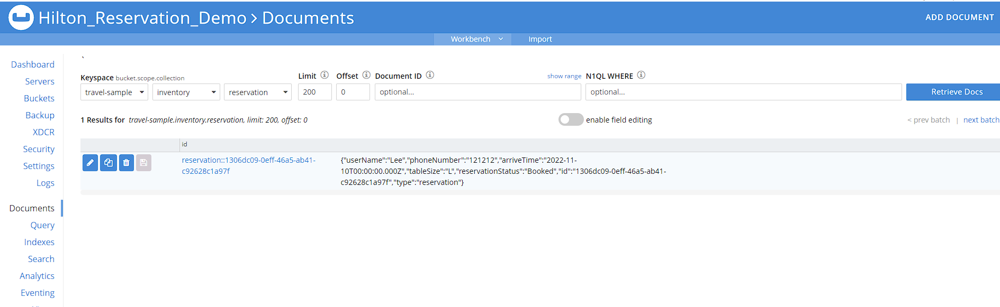
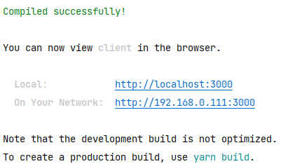
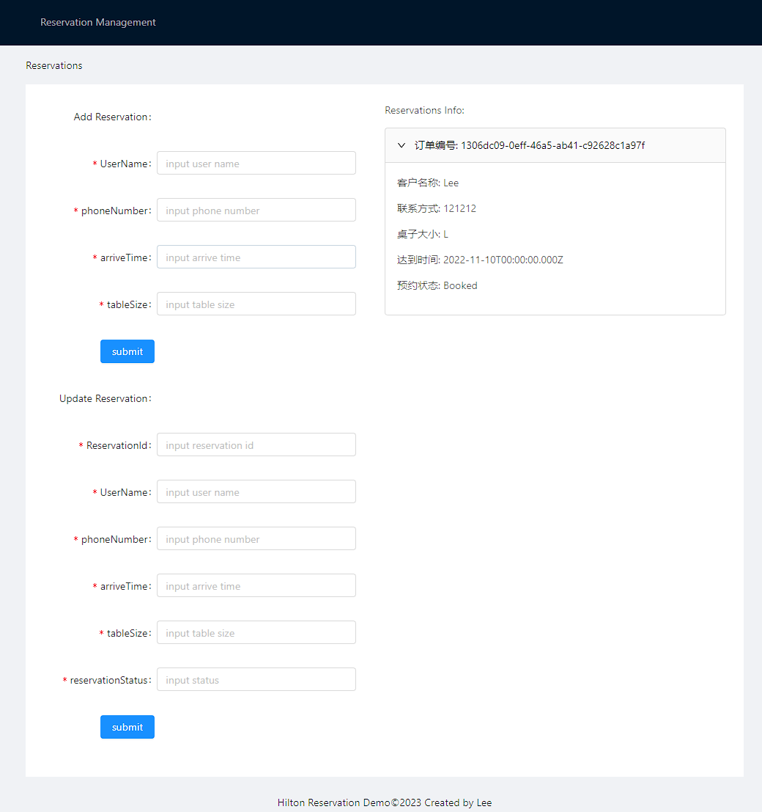

### This project is a sample Hilton reservation, including client and server

## Start the server side

```shell
cd .\server\ 

# Configuring couchbase
docker compose up -d
```


### `Initialize couchbase`
```
When the status of couchbase is Running：
```


Open http://localhost:8091/ui/index.html and configure it as follows https://docs.couchbase.com/server/7.0/install/getting-started-docker.html

Then change the account password (server/src/index.ts) in the project as follows.



```
Once the configuration is complete, you can start the server
```
```shell
cd .\server\ 

yarn install

yarn start

# open playground
open http://localhost:4000/graphql

# server test curl
curl 'http://localhost:4000/graphql' -H 'Accept-Encoding: gzip, deflate, br' -H 'Content-Type: application/json' -H 'Accept: application/json' -H 'Connection: keep-alive' -H 'DNT: 1' -H 'Origin: http://localhost:4000' --data-binary '{"query":"mutation {\n  addReservation(\n    args: { \n      userName: \"Lee\", \n      phoneNumber: \"121212\", \n      arriveTime: \"2022-11-10\", \n      tableSize: \"L\", \n      reservationStatus: \"Booked\" }\n  ) {\n    userName\n    phoneNumber\n    arriveTime\n    tableSize\n    reservationStatus\n  }\n}\n"}' --compressed
```
```
When you see the data inserted successfully and you can see it in couchbase, it means the server started successfully, as follows
```




## Start client

```shell
 cd .\client\

yarn install

yarn start
```
```
When you see the console output as follows
```


open http://localhost:3000/ and you can see the Reservation Manager Page, then you can start to user it 

